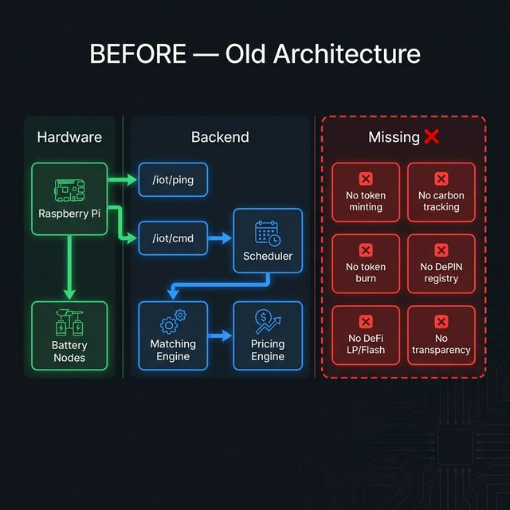
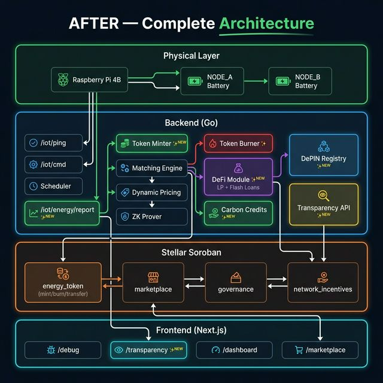
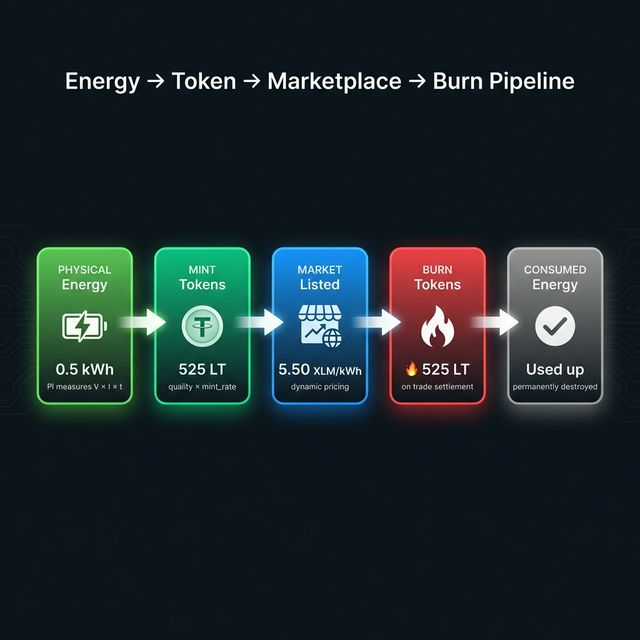
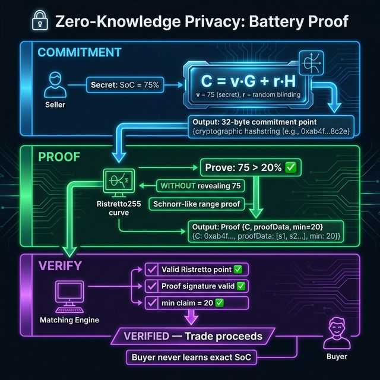
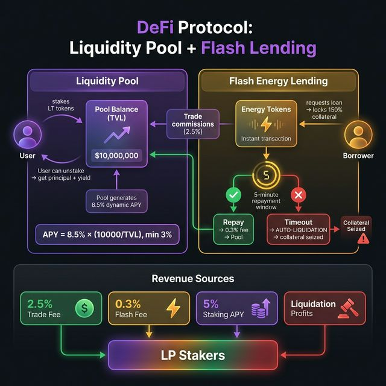
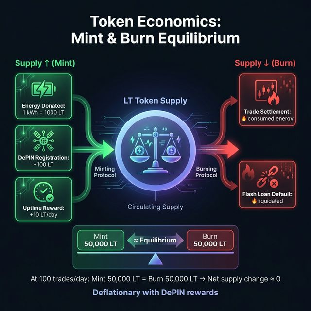
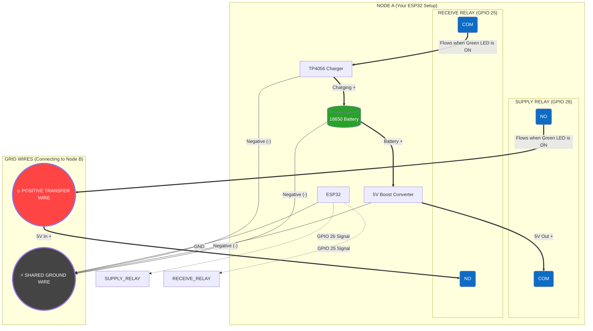

# Los Técnicos — Architecture & Changes Documentation

## Table of Contents
- [What Changed (Before → After)](#what-changed)
- [Energy → Token → Marketplace Flow](#energy-flow)
- [Zero-Knowledge Proofs Deep Dive](#zk-deep-dive)
- [DeFi Protocol Deep Dive](#defi-deep-dive)
- [Token Economics (Mint/Burn)](#token-economics)
- [Complete System Architecture](#complete-system)
- [Smart Contracts](#smart-contracts)
- [Dynamic Pricing Engine](#pricing-engine)
- [DePIN Network](#depin)
- [Carbon Credits](#carbon-credits)
- [API Reference](#api-reference)
- [Revenue Model](#revenue-model)

---

## What Changed (Before → After) {#what-changed}

### BEFORE — Old Architecture



**Problems:**
- Energy transferred but never tokenized
- No burn mechanism → infinite token inflation
- DeFi = simple 5% yield, no LP, no flash loans
- No carbon tracking
- No hardware registry (DePIN)
- No public transaction ledger

---

### AFTER — Complete Architecture



### Files Changed / Added

| File | Status | What Changed |
|------|--------|-------------|
| `backend/internal/core/domain/models.go` | MODIFIED | +6 models: `EnergyMint`, `TokenBurn`, `LiquidityPool`, `FlashLoan`, `CarbonCredit`, `DePINNode` |
| `backend/internal/database/database.go` | MODIFIED | Registered all 6 new models in `AutoMigrate` |
| `backend/internal/handlers/energy_mint.go` | **NEW** | Energy metering → token minting + auto-sell + carbon credits |
| `backend/internal/handlers/defi.go` | **NEW** | LP staking, flash loans, yield vaults, pool stats |
| `backend/internal/handlers/ledger.go` | **NEW** | 6 transparency endpoints (overview, mints, burns, carbon, prices) |
| `backend/internal/handlers/depin.go` | **NEW** | DePIN node registration, heartbeat, rewards, stats |
| `backend/internal/handlers/routes.go` | MODIFIED | +20 new routes (44 total) |
| `backend/internal/matching/engine.go` | MODIFIED | Added token burn + trade fee + carbon credit on settlement |
| `stellar_smart_contract/.../energy_token/contract.rs` | MODIFIED | Added `burn()`, `transfer()`, `total_supply()`, `total_burned()` |
| `frontend/src/app/transparency/page.tsx` | **NEW** | 6-tab transparency dashboard |

---

## Energy → Token → Marketplace Flow {#energy-flow}



### Minting Math
```
TokensMinted = kWh_transferred × 1000 × QualityFactor

QualityFactor:
  - Voltage 3.6V-4.2V (Li-ion ideal range) → 1.0 to 1.1
  - Out of range → 0.85 penalty

Example: 0.5 kWh at 4.0V → 0.5 × 1000 × 1.067 = 533.5 LT tokens
```

### End-to-End Sequence

1. **Pi measures** energy: `kWh = V_avg × I_avg × duration_hours`
2. **Pi reports** to backend: `POST /iot/energy/report`
3. **Backend validates**: checks discharge command was active, kWh is plausible
4. **Quality check**: voltage stability → quality factor 0.85-1.1
5. **Soroban mint**: calls `energy_token.mint(donor, tokens)`
6. **Auto-list**: creates sell order at current dynamic price
7. **Carbon credit**: records CO₂ saved (kWh × 0.82 kg/kWh)
8. **SSE broadcast**: frontend updates in real-time
9. **Buyer purchases**: matching engine pairs buy+sell
10. **ZK verify**: seller proves battery > 20%
11. **Trade settles**: tokens transfer, burn executed, fee → LP
12. **Tokens burned**: 🔥 permanently removed from circulation

---

## Zero-Knowledge Proofs Deep Dive {#zk-deep-dive}



### Why ZK in Energy Trading?

**Problem:** A seller wants to sell energy, but the buyer needs proof the seller has enough battery to deliver. The seller doesn't want to reveal their exact battery level (privacy, competitive reasons).

**Solution:** Zero-Knowledge Range Proof — seller proves `battery > 20%` without revealing the actual value.

### The Math (Pedersen Commitment on Ristretto255)

```
C = v·G + r·H

Where:
  v = secret value (battery SoC × 100, e.g. 7500 for 75%)
  r = random blinding factor (cryptographically random scalar)
  G = base generator point on Ristretto255 curve
  H = independent generator (derived from G, DL unknown)
  C = commitment point (compressed 32 bytes)

Properties:
  - Perfectly Hiding: without knowing r, C reveals nothing about v
  - Computationally Binding: can't open C to a different v
  - Homomorphic: C(v1) + C(v2) = C(v1+v2) → enables range proofs
```

### Range Proof
```
Proves: v > threshold (e.g. 20%)

Method: Schnorr-like proof of knowledge
  1. Prover signs message "Range>20" using blinding factor r as key
  2. This proves knowledge of the opening (v, r) of commitment C
  3. Since GenerateRangeProof fails if v < threshold,
     valid proof ⟹ v > threshold

Current: MVP uses Schnorr signatures with real Ristretto255 commitments
Production: Full Bulletproofs (O(log n) in range bits) for tighter guarantees
```

### Where ZK Runs

```
Matching Engine (every 5 seconds):
  1. Find matching buy/sell orders
  2. Calculate dynamic price
  3. ──► ZK GATE ◄──
     │  zk.NewPedersenCommitment(SoC × 100)
     │  zk.GenerateRangeProof(min=20)
     │  zk.VerifyRangeProof(proof)
     │  IF FAIL → reject match, continue
     │  IF PASS → proceed to settlement
  4. Execute trade at dynamic price
  5. Burn tokens
```

---

## DeFi Protocol Deep Dive {#defi-deep-dive}



### 1. Liquidity Pool (LP Staking)

**Dynamic APY Formula:**
```
If TVL ≤ 10,000 LT:  APY = 8.5% (base rate)
If TVL > 10,000 LT:  APY = 8.5% × (10,000 / TVL), floor 3.0%

Rationale: Early stakers earn higher yields → bootstraps liquidity
```

**Yield Calculation:**
```
Yield = AmountStaked × (APY / 100) × (HoursStaked / 8760)

Example: Stake 1000 LT for 48 hours at 8.5% APY
    = 1000 × 0.085 × (48/8760) = 0.466 LT yield
```

### 2. Flash Energy Lending

| Parameter | Value | Rationale |
|-----------|-------|-----------|
| Fee | 0.3% | Low enough for arbitrage, high enough for LP yield |
| Max borrow | 80% of pool | Prevent pool drain |
| Collateral | 150% | Cover potential default + profit |
| Repayment window | 5 minutes (300s) | One "energy epoch" |
| Liquidation | Automatic | No manual intervention needed |

**Use Case:** Borrower needs immediate energy tokens to cover a peak-demand trade. Borrows from LP, executes trade at high price, repays loan + 0.3% fee. Profit = price spread minus fee.

### 3. Yield Sources (Combined)

| Source | Rate | Goes To |
|--------|------|---------|
| Base staking APY | 8.5% annual | LP stakers |
| Trade commission | 2.5% per trade | LP stakers (pro-rata) |
| Flash loan fee | 0.3% per loan | LP pool |
| Flash liquidation | 50% of collateral | LP pool |
| Seller staking yield | 5% APY on locked order | Seller (during settlement) |

---

## Token Economics (Mint/Burn) {#token-economics}



**Supply equilibrium:** At ~100 trades/day with average 0.5 kWh:
- Daily mint: 100 × 500 = 50,000 LT
- Daily burn: 100 × 500 = 50,000 LT (if all traded energy is consumed)
- **Net supply change ≈ 0** (slightly deflationary with DePIN rewards being small)

---

## Complete System Architecture {#complete-system}

### Full Stack Summary

| Layer | Technology | Components |
|-------|-----------|-----------|
| **Hardware** | Raspberry Pi 4B, Li-ion batteries, relay circuits | SoC sensors, current sensors, voltage ADC |
| **Backend** | Go, Gin, GORM, PostgreSQL | 44 API endpoints, scheduling, matching, pricing |
| **Blockchain** | Stellar Soroban (Rust) | 4 smart contracts |
| **Frontend** | Vite, React, TailwindCSS, shadcn/ui | Dashboard, marketplace, debug, transparency |
| **Hosting** | Render (backend), Vercel (frontend) | Auto-deploy on push |
| **ZK** | Ristretto255 (Go) | Pedersen commitments, range proofs |
| **DeFi** | LP + Flash Loans (Go + Soroban) | 8.5% APY, 0.3% flash fee |

---

## Smart Contracts {#smart-contracts}

### energy_token (Soroban)
```rust
initialize(admin)                    // One-time setup
mint(to, amount)                     // Tracks total_supply
burn(from, amount)                   // ✨ NEW: Destroy consumed tokens
transfer(from, to, amount)           // ✨ NEW: Wallet-to-wallet
get_balance(user) -> i128
total_supply() -> i128               // ✨ NEW: Circulating supply
total_burned() -> i128               // ✨ NEW: Deflationary tracking
```

### marketplace (Soroban)
```rust
create_order(user, type, kwh, price, device_id)
match_orders(sell_id, buy_id)        // Admin validates + settles
calculate_yield(amount) -> 5% APY
get_order(order_id)
```

### governance (Soroban)
```rust
create_proposal(proposer, title, desc, duration)
vote(voter, proposal_id, support)
finalize_proposal(proposal_id)       // Tally after deadline
get_proposal(proposal_id)
```

### network_incentives (Soroban)
```rust
register_node(node_id, operator)
report_activity(node_id, packets)    // 1 LT per 100 packets
get_node_info(node_id)
```

---

## Dynamic Pricing Engine {#pricing-engine}

```
FinalPrice = BasePrice × F_sd × F_soc × F_dist × F_time × F_quality

Bounded: 0.5x to 5.0x multiplier → Price range: 2.5 to 25.0 XLM/kWh
```

| Factor | Formula | What Drives It |
|--------|---------|----------------|
| **F_sd** | `1 + 0.2 × ln(D/S)` | Open order counts |
| **F_soc** | `1 + 0.5 × (1-SoC)²` | **Real Pi battery data** |
| **F_dist** | `1 + 0.2 × d_km` | Buyer-seller distance |
| **F_time** | Peak=1.3, Night=0.85 | System clock |
| **F_quality** | `1 + 0.1 × Q` | Device reliability score |

**Key:** SoC factor reads from `scheduling.GetGridSoC("rpi-4b-prod-01")` → **real hardware data feeds directly into pricing**.

---

## DePIN Network {#depin}

### Reward Structure
| Action | Reward | Frequency |
|--------|--------|-----------|
| Register hardware | 100 LT | One-time |
| Stay online 24h | 10 LT/day | Continuous |
| Route 1 kWh | 1 LT | Per transfer |
| >90% monthly uptime | 50 LT bonus | Monthly |

### Health Scoring
```
ReliabilityPct = (TotalUptime / TimeSinceRegistration) × 100

Network Health:
  - Excellent: avg reliability >90%, >80% nodes online
  - Good: avg reliability >70%, >50% online
  - Degraded: avg reliability >50%
  - Critical: below 50%
```

---

## Carbon Credits {#carbon-credits}

```
CO₂_saved = kWh_transferred × EmissionFactor

India grid emission factor = 0.82 kg CO₂/kWh
Credit value = CO₂_saved × 0.05 XLM/kg

Example: 0.5 kWh P2P trade
  = 0.5 × 0.82 = 0.41 kg CO₂ saved
  = 0.41 × 0.05 = 0.0205 XLM credit value

Tree equivalent: 1 tree absorbs ~21.77 kg CO₂/year
```

---

## API Reference {#api-reference}

### Energy Metering (NEW)
| Method | Endpoint | Description |
|--------|----------|-------------|
| POST | `/iot/energy/report` | Pi reports kWh transferred → mints tokens |
| GET | `/api/v1/tokens/supply` | Token supply stats |

### DeFi (NEW)
| Method | Endpoint | Description |
|--------|----------|-------------|
| POST | `/api/v1/defi/pool/stake` | Stake tokens in LP |
| POST | `/api/v1/defi/pool/unstake` | Withdraw + yield |
| GET | `/api/v1/defi/pool/stats` | TVL, APY, utilization |
| POST | `/api/v1/defi/flash-loan` | Borrow tokens (5-min epoch) |
| POST | `/api/v1/defi/flash-loan/repay` | Repay flash loan |
| GET | `/api/v1/defi/yield/history` | Yield history |

### Transparency Ledger (NEW)
| Method | Endpoint | Description |
|--------|----------|-------------|
| GET | `/api/v1/ledger/overview` | Full system stats |
| GET | `/api/v1/ledger/transactions` | All trades |
| GET | `/api/v1/ledger/mints` | Token minting events |
| GET | `/api/v1/ledger/burns` | Token burn events |
| GET | `/api/v1/ledger/carbon` | Carbon credit ledger |
| GET | `/api/v1/ledger/price-history` | Dynamic price history |

### DePIN (NEW)
| Method | Endpoint | Description |
|--------|----------|-------------|
| POST | `/api/v1/depin/register` | Register hardware node |
| POST | `/api/v1/depin/heartbeat` | Update uptime, earn rewards |
| GET | `/api/v1/depin/nodes` | All registered nodes |
| GET | `/api/v1/depin/stats` | Network statistics |

---

## Revenue Model {#revenue-model}

| Revenue Stream | Rate | Source |
|----------------|------|--------|
| Trade Commission | **2.5%** of settlement | Every matched trade → LP stakers |
| Minting Fee | **1%** of tokens | Energy → token conversion |
| Flash Loan Fee | **0.3%** per loan | Instant energy borrowing |
| Flash Liquidation | **50%** of collateral | Defaulted flash loans |
| Withdrawal Fee | **0.5%** + gas | Fiat off-ramp (DoDo) |

**Break-even:** At 35 trades/day × 0.5 kWh × 5.5 XLM × 2.5% = **2.41 XLM/day** in commission alone.

---

## Hardware & Custom Protocol {#hardware-protocol}

### Raspberry Pi ↔ ESP32 Command Translation
The backend orchestrates transfers using the terms `discharge` and `charge`. However, the physical ESP32 nodes (`energy_firmware.ino`) do not understand these strings. They use a custom 8080 TCP Socket protocol.

The python script on the Pi (`energy_grid_updated.py`) securely translates Internet API commands into Local Hardware commands:

| Backend API Action | Transmitted over Local Network as | Physical Action Triggered |
|--------------------|-----------------------------------|---------------------------|
| `discharge`        | `SUPPLY`                          | Opens GPIO 26 (Relay 2 - Boost Converter) |
| `charge`           | `RECEIVE`                         | Opens GPIO 25 (Relay 1 - TP4056 Charger)  |
| *(none / idle)*    | `IDLE`                            | Closes all relays for safety |

### Physical Wiring Diagram (The ESP32 End)
For electricity to flow properly, nodes must be wired correctly. Relays **must** use the `COM` and `NO` (Normally Open) terminals. If `NC` (Normally Closed) is used, the logic is reversed and transfers will fail. Furthermore, the two nodes must share a Common Ground.


