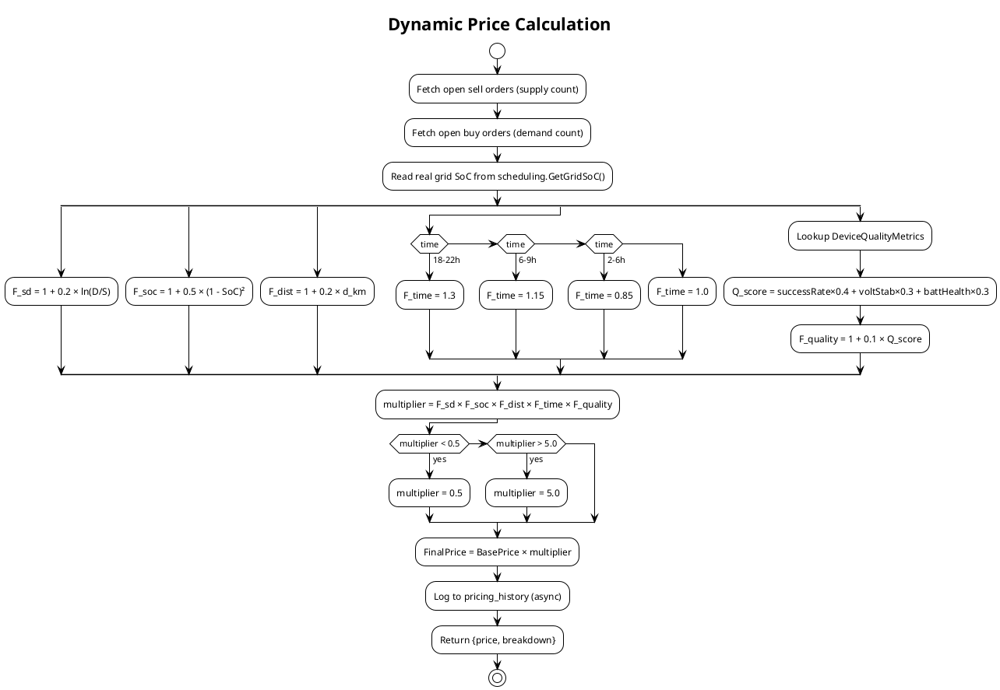

# Dynamic Pricing Engine

The pricing engine calculates a fair, real-time price for every energy trade. It replaces arbitrary utility tariffs with a multi-factor model driven by actual market conditions. The coefficients can be adjusted by community governance.

---

## The Formula

```
FinalPrice = BasePrice × F_sd × F_soc × F_dist × F_time × F_quality

Bounded: multiplier clamped to [0.5x, 5.0x]
Price range: 2.5 – 25.0 XLM/kWh (at BasePrice = 5.0)
```

---

## Factor Breakdown

### 1. Supply-Demand Factor (F_sd)

```
F_sd = 1 + α × ln(Demand / Supply)
```

| Variable | Description | Default |
|----------|-------------|---------|
| `α` (Alpha) | Supply/demand coefficient | `0.2` |
| `Demand` | Count of open buy orders | Live DB query |
| `Supply` | Count of open sell orders | Live DB query |

**Behavior:**
- Equal supply and demand (`D/S = 1`) → `F_sd = 1.0` (neutral)
- High demand relative to supply → logarithmically increases price
- High supply relative to demand → logarithmically decreases price
- Floor prevents `Supply = 0` division: defaults to 1

**Go implementation:**
```go
func (pe *PricingEngine) getSupplyDemandFactor(supply, demand float64) float64 {
    if supply <= 0 { supply = 1 }
    if demand <= 0 { demand = 0.1 }
    ratio := demand / supply
    return 1.0 + pe.Config.Alpha * math.Log(ratio)
}
```

---

### 2. State-of-Charge Factor (F_soc)

```
F_soc = 1 + β × (1 - SoC_avg)²
```

| Variable | Description | Default |
|----------|-------------|---------|
| `β` (Beta) | SoC scarcity coefficient | `0.5` |
| `SoC_avg` | Average battery level (0–1 normalized) | Live hardware data |

**Data source:** Reads from `scheduling.GetGridSoC("rpi-4b-prod-01")` — this directly queries real Raspberry Pi node data from the `node_details` table. If hardware is offline, falls back to the passed-in average from the IoT device table.

**Behavior:**
- Full batteries (SoC = 1.0) → `F_soc = 1.0` (no scarcity premium)
- Half charge (SoC = 0.5) → `F_soc = 1 + 0.5 × 0.25 = 1.125`
- Low charge (SoC = 0.2) → `F_soc = 1 + 0.5 × 0.64 = 1.32`
- Critical (SoC = 0.0) → `F_soc = 1 + 0.5 × 1.0 = 1.5`

The **quadratic** relationship `(1 - SoC)²` is intentional — price acceleration steepens as battery supply becomes critical, creating strong price signals.

---

### 3. Distance Factor (F_dist)

```
F_dist = 1 + γ × d_km
```

| Variable | Description | Default |
|----------|-------------|---------|
| `γ` (Gamma) | Distance penalty coefficient | `0.2` |
| `d_km` | Distance between buyer and seller (km) | `1.0` (local, MVP) |

**Purpose:** Models transmission losses and infrastructure costs. Local trades are cheaper. Community governance can vote to reduce Gamma to incentivize broader energy sharing, or increase it to keep energy hyperlocal.

---

### 4. Time-of-Day Factor (F_time)

| Time Window | Factor | Rationale |
|-------------|--------|-----------|
| Evening peak (18:00–22:00) | `1.3` | AC, cooking, peak demand |
| Morning peak (06:00–09:00) | `1.15` | Commute, breakfast |
| Night trough (02:00–06:00) | `0.85` | Lowest consumption |
| Standard hours | `1.0` | Baseline |

---

### 5. Seller Quality Factor (F_quality)

```
F_quality = 1 + η × Q_score

Q_score = (SuccessRate × 0.4) + (VoltageStability/100 × 0.3) + (BatteryHealth/100 × 0.3)
η (eta) = 0.1
```

| Component | Weight | Source |
|-----------|--------|--------|
| Successful delivery rate | 40% | `device_quality_metrics.successful_deliveries / total_deliveries` |
| Voltage stability | 30% | Score computed from deviation from 3.85V midpoint |
| Battery health | 30% | Raw battery level from last ping |

**Voltage stability calculation:**
```
deviation = |avg_voltage - 3.85|
score = 100 - (deviation / 0.35 × 100)
clamp(score, 0, 100)
```

A device with perfect delivery history, stable voltage (within Li-ion range 3.7–4.2V), and good battery health gets a small premium — rewarding reliable energy suppliers.

---

## Complete Worked Example

Scenario: Morning peak (08:30), moderate supply/demand balance, Pi at 65% SoC, local (1km) seller with good reliability.

| Factor | Inputs | Result |
|--------|--------|--------|
| F_sd | Supply=5, Demand=7 | `1 + 0.2 × ln(1.4) = 1.068` |
| F_soc | SoC=0.65 → deficit=0.35 | `1 + 0.5 × 0.1225 = 1.061` |
| F_dist | d=1km | `1 + 0.2 × 1 = 1.2` |
| F_time | 08:30, morning peak | `1.15` |
| F_quality | Q_score=0.8 | `1 + 0.1 × 0.8 = 1.08` |
| **Total multiplier** | 1.068 × 1.061 × 1.2 × 1.15 × 1.08 | **1.804** |
| **Final price** | 5.0 × 1.804 | **9.02 XLM/kWh** |

---

## Governance Control

The `α`, `β`, and `γ` coefficients are stored in `PricingConfig` and populated by `FetchGovernanceParams()`. In production, this function queries the Soroban governance contract's storage for the latest passed proposals. The community can vote to:

- Lower `γ` → reduce distance penalty, encourage broader sharing
- Increase `β` → amplify scarcity signals during low-battery periods
- Lower `α` → dampen supply/demand volatility

---

## Price History Logging

Every price calculation is persisted asynchronously:

```go
record := domain.PricingHistory{
    Timestamp:    time.Now(),
    BasePrice:    factors["base_price"],
    FinalPrice:   factors["final_price"],
    SupplyDemand: factors["f_sd"],
    SoC:          factors["f_soc"],
    Distance:     factors["f_dist"],
    Time:         factors["f_time"],
    Quality:      factors["f_quality"],
    GridSoC:      soc,
    TotalDemand:  demand,
    TotalSupply:  supply,
}
database.DB.Create(&record)
```

Queryable via `GET /api/v1/ledger/price-history`.

---

## Price Flow Diagram


