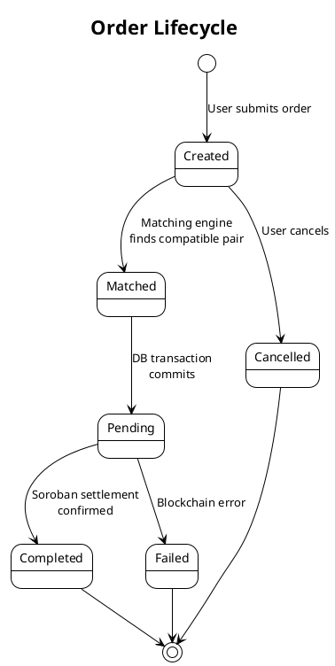

# Matching Engine

The matching engine runs as a background goroutine that polls for compatible buy and sell orders every 5 seconds. When a match is found, it sequences through price calculation, ZK verification, database settlement, IoT notification, and Soroban execution — all within a single atomic transaction.

---

## Core Loop

```go
func RunMatchingEngine(sorobanClient *blockchain.SorobanClient) {
    ticker := time.NewTicker(5 * time.Second)
    for range ticker.C {
        matchOrders(sorobanClient)
    }
}
```

The goroutine is launched at server startup alongside the SSE broker. It has no HTTP handler — it is a pure background worker.

---

## Matching Logic

### Order Selection

```
1. Fetch open sell orders — sorted by token_price ASC (cheapest first)
2. Fetch open buy orders  — sorted by token_price DESC (highest bidder first)
```

Price-time priority: within the same price tier, earlier orders are matched first due to database insertion order.

### Match Conditions

For each `(sell, buy)` pair to execute, **all** of the following must be true:

| Condition | Check |
|-----------|-------|
| Both orders still open | `status == "Created"` |
| Buyer's price >= dynamic price | `buyOrder.TokenPrice >= dynamicPrice` |
| Quantities equal | `buyOrder.KwhAmount == sellOrder.KwhAmount` |
| ZK proof valid | `VerifyRangeProof(proof) == true` |

### Settlement (Atomic DB Transaction)

When all conditions pass, a single `database.DB.Transaction()` commits:

1. Update both orders → `status = "Matched"`
2. Insert `Transaction` record (status `"Pending"`, blockchain hash `"pending_{id}"`)
3. Insert `YieldRecord` for seller (5% APY accrual on trade value)
4. Insert `TokenBurn` — `kWh × 1000` tokens destroyed
5. Insert `YieldRecord` for LP pool (2.5% trade commission)
6. Insert `CarbonCredit` — `kWh × 0.82 kg CO₂`

If any step fails, the entire transaction rolls back. Orders remain open.

### Post-Settlement Actions

After the DB transaction commits:

1. **IoT notification:** If donor has a registered ESP32, sends MQTT lock command via `mqtt.SendLockCommand(device.ID, orderID, kwhAmount)`
2. **Soroban execution:** `sorobanClient.HandleTradeExecution(buyOrder)` runs asynchronously in a goroutine — on-chain settlement does not block the matching loop

---

## Token Burn on Settlement

Every completed trade burns tokens permanently:

```go
tokensBurned := buyOrder.KwhAmount * 1000  // 1 kWh = 1000 LT

burnRecord := domain.TokenBurn{
    OrderID:      buyOrder.ID,
    TokensBurned: tokensBurned,
    BurnReason:   "trade_settlement",
    TxHash:       "burn_" + timestamp,
    Timestamp:    time.Now(),
}
```

This maintains supply equilibrium: at steady-state trading volume, daily mints ≈ daily burns.

---

## ZK Gate

The ZK privacy check sits between price calculation and trade execution. See [Zero-Knowledge Proofs](./zero-knowledge) for the full cryptographic detail. At the matching engine level:

```go
// 1. Generate commitment from community SoC (proxy for seller's real SoC)
zkCommitment, err := zk.NewPedersenCommitment(int64(socAvg * 100))

// 2. Generate range proof: battery > 20%
proof, err := zkCommitment.GenerateRangeProof(20)
if err != nil {
    continue  // reject — can't prove capacity
}

// 3. Verify
if !zk.VerifyRangeProof(proof) {
    continue  // reject — proof invalid
}
```

If the average community SoC falls below 20%, all trades requiring ZK verification are blocked until charge recovers.

---

## Revenue Flows per Trade

```plantuml
@startuml
!theme plain

title Revenue and Value Flows on Trade Settlement

rectangle "Trade: 0.5 kWh @ 9 XLM" {
  (Settlement value\n= 4.5 XLM) as VAL
}

rectangle "Seller (Sarah)" as S
rectangle "LP Stakers" as LP
rectangle "Burn" as BURN
rectangle "Carbon Credit" as CC
rectangle "Yield (Seller)" as YS

VAL --> S : 4.5 XLM gross proceeds
VAL --> LP : 4.5 × 2.5% = 0.1125 XLM trade fee
VAL --> YS : 4.5 × 5%/365 = 0.000616 XLM daily yield

BURN : 500 LT tokens destroyed\n(0.5 kWh × 1000)
CC : 0.41 kg CO₂ offset\n(0.5 × 0.82 emission factor)\n= 0.0205 XLM credit value

@enduml
```

---

## Matching Engine State Diagram



---

## Community SoC Calculation

The matching engine uses `GetCommunitySoC()` to derive an average grid battery level:

```go
func GetCommunitySoC() float64 {
    var devices []domain.IoTDevice
    database.DB.Find(&devices)

    var totalSoC float64
    for _, d := range devices {
        totalSoC += d.BatteryLevel  // normalized 0.0–1.0
    }
    return totalSoC / float64(len(devices))
}
```

This value feeds both the ZK gate (as proxy for seller SoC) and the pricing engine's F_soc factor.
