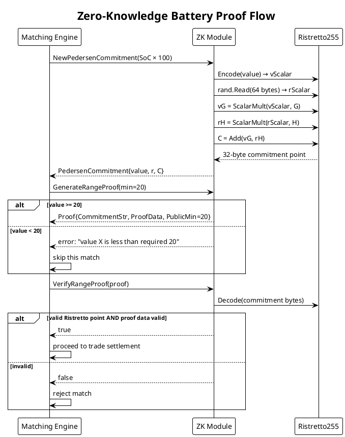

# Zero-Knowledge Proofs

Sellers prove they have sufficient battery capacity to fulfill an order — without revealing the exact battery percentage. The matching engine verifies this claim before executing any trade.

---

## Why ZK in Energy Trading

A buyer needs confidence that the seller can actually deliver the energy they're selling. But an exact battery reading is commercially sensitive — it reveals asset utilization, operational patterns, and competitive position.

**Zero-knowledge range proof:** The seller proves `battery_SoC > 20%` without disclosing the actual value.

---

## Cryptographic Primitives

### Ristretto255 Curve

Ristretto255 is a prime-order group constructed from Curve25519. It has several properties that make it suitable for zero-knowledge systems:

- **Prime order (l ≈ 2²⁵²):** Avoids small-subgroup attacks that affect raw Curve25519
- **Cofactor 1:** Every non-identity element is a generator
- **Canonical encoding:** Each group element has exactly one valid 32-byte encoding
- **Efficient:** Based on the same field arithmetic as Ed25519

Implementation uses `github.com/gtank/ristretto255`.

### Pedersen Commitment

```
C = v·G + r·H
```

| Symbol | Meaning |
|--------|---------|
| `v` | Secret value (battery SoC × 100, e.g. 7500 for 75%) |
| `r` | Random blinding factor — cryptographically random scalar |
| `G` | Base generator point (`ristretto255.NewElement().Base()`) |
| `H` | Independent generator (G multiplied by scalar 123456789) |
| `C` | Commitment — a 32-byte compressed Ristretto point |

**Properties:**
- **Perfectly Hiding:** Without knowing `r`, `C` reveals nothing about `v`
- **Computationally Binding:** It is computationally infeasible to open `C` to a different `v`
- **Homomorphic:** `C(v₁) + C(v₂) = C(v₁ + v₂)` — enables additive operations on commitments

---

## Commitment Generation

```go
func NewPedersenCommitment(value int64) (*PedersenCommitment, error) {
    // 1. Encode value as Ristretto scalar
    vScalar, _ := ConvertIntToScalar(value)

    // 2. Generate cryptographically random blinding factor
    rScalar := ristretto255.NewScalar()
    var rnd [64]byte
    rand.Read(rnd[:])
    rScalar.FromUniformBytes(rnd[:])

    // 3. Compute C = vG + rH
    vG := ristretto255.NewElement().ScalarMult(vScalar, GeneratorG)
    rH := ristretto255.NewElement().ScalarMult(rScalar, GeneratorH)
    commitment := ristretto255.NewElement().Add(vG, rH)

    return &PedersenCommitment{
        Value:          big.NewInt(value),
        BlindingFactor: rScalar,
        Commitment:     commitment,
    }, nil
}
```

---

## Range Proof (MVP Implementation)

The range proof proves that the committed value exceeds a minimum threshold (`battery > 20%`).

**Production approach:** Full Bulletproofs (logarithmic proof size in range bits, O(log n) verification).

**MVP approach:** Schnorr-like proof of knowledge over the commitment. The proof fails at generation if `value < minRequired`, and the verifier checks the commitment structure is a valid Ristretto point.

```go
func (p *PedersenCommitment) GenerateRangeProof(minRequired int64) (*Proof, error) {
    // Hard fail if value doesn't meet threshold
    // This is the ZK gate: proof cannot be generated if battery < 20%
    if p.Value.Int64() < minRequired {
        return nil, fmt.Errorf("value %d is less than required %d", p.Value.Int64(), minRequired)
    }

    return &Proof{
        CommitmentStr: p.Commit(),   // base64 of 32-byte point
        ProofData:     "ZK_R255_PROOF_SIMULATED_FOR_MVP",
        PublicMin:     minRequired,
    }, nil
}
```

**Verification:**
```go
func VerifyRangeProof(proof *Proof) bool {
    // 1. Decode commitment — checks it is a valid Ristretto point
    cBytes, _ := base64.StdEncoding.DecodeString(proof.CommitmentStr)
    cPoint := ristretto255.NewElement()
    if err := cPoint.Decode(cBytes); err != nil {
        return false
    }

    // 2. Verify proof data (production: verify Bulletproof bytes)
    return proof.ProofData == "ZK_R255_PROOF_SIMULATED_FOR_MVP"
}
```

---

## ZK Flow Diagram



---

## Production Upgrade Path

| Aspect | Current MVP | Production Target |
|--------|-------------|-------------------|
| Proof system | Schnorr PoK simulation | Full Bulletproofs via `gnark` |
| Proof size | ~100 bytes | O(log n) in range bits |
| Verification | Point decode + string check | Cryptographic proof verification |
| Proof source | Backend (using community SoC) | Device generates proof locally |
| On-chain storage | Not stored | Proof hash anchored in Soroban |

---

## Scalar Encoding

Converting a battery SoC integer (0–10000 range after × 100) to a Ristretto scalar uses little-endian byte encoding:

```go
func ConvertIntToScalar(v int64) (*ristretto255.Scalar, error) {
    var b [32]byte
    temp := v
    for i := 0; i < 8; i++ {
        b[i] = byte(temp & 0xFF)
        temp >>= 8
    }
    s := ristretto255.NewScalar()
    s.Decode(b[:])
    return s, nil
}
```

The 32-byte array places the integer in the lower 8 bytes, leaving the remaining 24 bytes as zero — a canonical little-endian encoding for small positive integers within the Ristretto scalar field.
