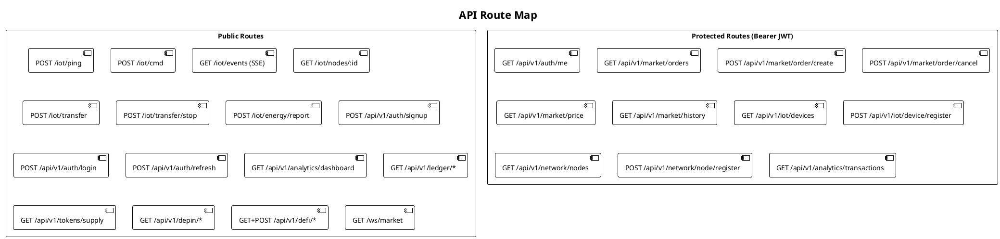

# API Reference

The Stelltron backend exposes a REST API built on Go/Gin. All protected endpoints require a `Bearer` JWT token in the `Authorization` header.

**Base URL:**
- Local: `http://localhost:8080`
- Production: `https://los-tecnicos-backend.onrender.com`

---

## Authentication

### POST /api/v1/auth/signup

Register a new user by verifying their Stellar wallet signature.

**Request:**
```json
{
  "wallet_address": "GCKFBEIYTKP4BOFPNR4MXKCDQHM3BLFBE4MIFP7GHPDMMCQKWMQ7WT",
  "signature": "<base64-encoded Ed25519 signature>"
}
```

The signature must be over the message `"los-tecnicos-auth"` using the Stellar message prefix:
```
SHA256("Stellar Signed Message:\n" + "los-tecnicos-auth")
```

**Response 201:**
```json
{
  "id": "GCKFBEIYTKP4...",
  "wallet_address": "GCKFBEIYTKP4...",
  "role": "Recipient",
  "kyc_status": "pending",
  "created_at": "2026-02-23T09:56:48Z"
}
```

**Response 200:** Returns existing user if wallet already registered.

---

### POST /api/v1/auth/login

Authenticate an existing user and return JWT tokens.

**Request:** Same as signup.

**Response 200:**
```json
{
  "access_token": "<JWT, 15-minute TTL>",
  "refresh_token": "<UUID, 7-day TTL>"
}
```

---

### POST /api/v1/auth/refresh

Exchange a refresh token for a new access token.

**Request:**
```json
{
  "refresh_token": "<UUID>"
}
```

**Response 200:**
```json
{
  "access_token": "<new JWT>"
}
```

---

### GET /api/v1/auth/me

Returns the authenticated user's profile.

**Headers:** `Authorization: Bearer <access_token>`

**Response 200:**
```json
{
  "id": "GCKFBEIYTKP4...",
  "wallet_address": "GCKFBEIYTKP4...",
  "role": "Donor",
  "location": "",
  "kyc_status": "pending",
  "created_at": "2026-02-23T09:56:48Z"
}
```

---

## Market

All market routes require `Authorization: Bearer <access_token>`.

### GET /api/v1/market/orders

Returns all open (status = `"Created"`) energy orders.

**Response 200:**
```json
[
  {
    "id": "550e8400-e29b-41d4-a716-446655440000",
    "user_id": "GCKFBEIY...",
    "type": "sell",
    "kwh_amount": 0.5,
    "token_price": 9.02,
    "status": "Created",
    "created_at": "2026-02-23T09:00:00Z"
  }
]
```

---

### POST /api/v1/market/order/create

Create a buy or sell order.

**Request:**
```json
{
  "type": "buy",
  "kwh_amount": 0.5,
  "token_price": 10.0
}
```

**Role enforcement:**
- `sell` orders: user must be `Donor` or `NetworkNodeOperator`
- If role is `Recipient`, automatically promoted to `Donor` on first sell

**Response 201:**
```json
{
  "id": "550e8400-...",
  "user_id": "GCKFBEIY...",
  "type": "buy",
  "kwh_amount": 0.5,
  "token_price": 10.0,
  "status": "Created",
  "created_at": "2026-02-23T09:10:00Z"
}
```

---

### POST /api/v1/market/order/cancel

Cancel an open order owned by the authenticated user.

**Request:**
```json
{
  "order_id": "550e8400-..."
}
```

**Response 200:**
```json
{
  "message": "Order cancelled successfully"
}
```

---

### GET /api/v1/market/price

Returns the current dynamic market price with full factor breakdown.

**Response 200:**
```json
{
  "price": 9.02,
  "supply": 7,
  "demand": 5,
  "timestamp": "2026-02-23T09:10:00Z",
  "breakdown": {
    "base_price": 5.0,
    "f_sd": 0.927,
    "f_soc": 1.061,
    "f_dist": 1.2,
    "f_time": 1.15,
    "f_quality": 1.08,
    "final_price": 9.02
  }
}
```

---

### GET /api/v1/market/history

Returns up to 50 most recent completed trade prices for charting.

**Response 200:**
```json
[
  {
    "price": 8.75,
    "timestamp": "09:01"
  },
  {
    "price": 9.10,
    "timestamp": "09:04"
  }
]
```

---

## IoT (Hardware Endpoints)

These endpoints are called by the Raspberry Pi without authentication.

### POST /iot/ping

Receives the Pi's periodic telemetry update.

**Request (heartbeat):**
```json
{
  "device_id": "rpi-4b-prod-01",
  "status": "heartbeat"
}
```

**Request (node data):**
```json
{
  "device_id": "rpi-4b-prod-01",
  "voltage": 3.921,
  "battery_level": 72.4,
  "state": "IDLE",
  "source": "rpi_energy_grid",
  "timestamp": "2026-02-23T09:56:48Z",
  "connected_nodes_count": 2,
  "connected_nodes": [
    {"uid": "NODE_A", "voltage": 3.921},
    {"uid": "NODE_B", "voltage": 3.610}
  ],
  "nodes_detail": [
    {
      "uid": "NODE_A",
      "ip": "192.168.1.101",
      "voltage": 3.921,
      "soc": 72.4,
      "state": "IDLE"
    }
  ]
}
```

**Response 200:**
```json
{
  "status": "received",
  "type": "node_data",
  "updated": true,
  "commands": [
    {"node_id": "NODE_A", "action": "discharge"},
    {"node_id": "NODE_B", "action": "charge"}
  ]
}
```

---

### POST /iot/cmd

The Pi sends its current node states and receives scheduling commands.

**Request:**
```json
{
  "device_id": "rpi-4b-prod-01",
  "nodes": [
    {"uid": "NODE_A", "voltage": 3.921, "soc": 72.4, "state": "IDLE"},
    {"uid": "NODE_B", "voltage": 3.610, "soc": 28.1, "state": "IDLE"}
  ]
}
```

Maximum 5 nodes per request.

**Response 200:**
```json
{
  "commands": [
    {
      "node_id": "NODE_A",
      "action": "discharge",
      "reason": "manual transfer command (discharge)"
    },
    {
      "node_id": "NODE_B",
      "action": "charge",
      "reason": "manual transfer command (charge)"
    }
  ],
  "grid_summary": {
    "avg_soc": 50.25,
    "discharging_nodes": 1,
    "charging_nodes": 1,
    "idle_nodes": 0
  }
}
```

---

### GET /iot/nodes/:device_id

Returns all `NodeDetail` records for a given device.

**Response 200:** Array of node detail objects.

---

### POST /iot/transfer

Manually initiate an energy transfer between two nodes.

**Request:**
```json
{
  "device_id": "rpi-4b-prod-01",
  "sender_node_uid": "NODE_A",
  "receiver_node_uid": "NODE_B"
}
```

Writes `discharge` command for sender and `charge` command for receiver in `schedule_commands`.

---

### POST /iot/transfer/stop

Stop an active transfer and return all nodes to idle.

**Request:**
```json
{
  "device_id": "rpi-4b-prod-01"
}
```

---

### POST /iot/energy/report

Pi reports a completed physical energy transfer for token minting.

**Request:**
```json
{
  "device_id": "rpi-4b-prod-01",
  "sender_uid": "NODE_A",
  "receiver_uid": "NODE_B",
  "kwh_transferred": 0.5,
  "duration_seconds": 1800,
  "avg_voltage": 3.92,
  "avg_current": 0.27
}
```

Allowed range: `kwh_transferred` in `[0.001, 10.0]`.

**Response 200:**
```json
{
  "status": "minted",
  "tokens_minted": 533.3,
  "quality_factor": 1.067,
  "sell_order_id": "auto_sell_42",
  "dynamic_price": 9.02,
  "co2_saved_kg": 0.41,
  "carbon_credit": 0.0205,
  "tx_hash": "mint_20260223_095648",
  "message": "533.30 LT tokens minted for 0.5000 kWh → auto-listed at 9.02 XLM/kWh"
}
```

---

### GET /iot/events

Server-Sent Events stream. Frontend connects here for real-time grid updates.

**Response:** `text/event-stream`

```
data: {"timestamp":"2026-02-23T09:56:48Z","type":"heartbeat","payload":{"device_id":"rpi-4b-prod-01","status":"heartbeat"}}

data: {"timestamp":"2026-02-23T09:56:53Z","type":"node_data","payload":{...}}

data: {"timestamp":"2026-02-23T09:57:00Z","type":"schedule","payload":{"commands":[...],"grid_summary":{...}}}

data: {"timestamp":"2026-02-23T09:57:30Z","type":"energy_mint","payload":{"tokens_minted":533.3,...}}
```

---

## IoT Device Management (Protected)

### GET /api/v1/iot/devices

Returns all IoT devices registered to the authenticated user.

### POST /api/v1/iot/device/register

Register a new device for the authenticated user.

**Request:**
```json
{
  "device_type": "raspi",
  "location": "Bangalore, India"
}
```

---

## Network Nodes (Protected)

### GET /api/v1/network/nodes

Returns all registered network nodes.

### POST /api/v1/network/node/register

Register as a network node operator. Updates user role to `NetworkNodeOperator`.

**Request:**
```json
{
  "location": "Bangalore, India"
}
```

---

## DePIN

### POST /api/v1/depin/register

Register a hardware device in the DePIN network.

**Request:**
```json
{
  "device_id": "rpi-4b-prod-01",
  "operator_wallet": "GCKFBEIY...",
  "hardware_type": "rpi4b",
  "firmware_version": "1.2.0"
}
```

### POST /api/v1/depin/heartbeat

Report node uptime and route activity. Triggers reward calculation.

**Request:**
```json
{
  "device_id": "rpi-4b-prod-01",
  "kwh_routed": 0.5
}
```

### GET /api/v1/depin/nodes

Returns all registered DePIN nodes.

### GET /api/v1/depin/stats

Returns network-wide DePIN statistics including total nodes, average reliability, and network health status.

---

## DeFi

### POST /api/v1/defi/pool/stake

Stake LT tokens in the liquidity pool.

**Request:**
```json
{
  "user_id": "GCKFBEIY...",
  "amount": 1000.0
}
```

### POST /api/v1/defi/pool/unstake

Withdraw tokens plus accrued yield.

**Request:**
```json
{
  "stake_id": 42
}
```

### GET /api/v1/defi/pool/stats

Returns TVL, current APY, and pool utilization.

**Response 200:**
```json
{
  "total_staked": 50000.0,
  "active_stakers": 12,
  "current_apy": 5.1,
  "pool_utilization": 0.38
}
```

### POST /api/v1/defi/flash-loan

Borrow tokens for up to 5 minutes.

**Request:**
```json
{
  "borrower_id": "GCKFBEIY...",
  "kwh_borrowed": 5.0,
  "token_collateral": 7500.0
}
```

### POST /api/v1/defi/flash-loan/repay

Repay an active flash loan.

**Request:**
```json
{
  "loan_id": 7
}
```

### GET /api/v1/defi/yield/history

Returns yield history records.

---

## Transparency Ledger (Public)

All ledger endpoints are unauthenticated for public verifiability.

### GET /api/v1/ledger/overview

System-wide statistics: total minted, total burned, circulating supply, total CO₂ saved.

### GET /api/v1/ledger/transactions

All completed trades with blockchain hashes.

### GET /api/v1/ledger/mints

All token minting events with source device and quality factor.

### GET /api/v1/ledger/burns

All token burn events with reason and trade association.

### GET /api/v1/ledger/carbon

All carbon credit records with CO₂ saved and credit value.

### GET /api/v1/ledger/price-history

Historical price calculations with all factor breakdowns.

---

## Analytics

### GET /api/v1/analytics/dashboard

Public market statistics.

**Response 200:**
```json
{
  "total_users": 247,
  "total_iot_devices": 3,
  "total_network_nodes": 12,
  "total_energy_traded": 148.5,
  "active_orders": 8
}
```

### GET /api/v1/analytics/transactions (Protected)

Returns the authenticated user's transaction history (as donor or recipient).

---

## Token Supply

### GET /api/v1/tokens/supply

**Response 200:**
```json
{
  "total_minted": 250000.0,
  "total_burned": 240000.0,
  "circulating_supply": 10000.0,
  "total_mint_events": 500,
  "token_name": "LT (Los Técnicos Energy Token)",
  "ratio": "1 kWh = 1000 LT"
}
```

---

## WebSocket

### GET /ws/market

WebSocket connection for real-time market data. Currently sends a welcome message on connect and remains open. Future: live price tick broadcast.

---

## Route Summary



**Total: 44 endpoints** — 30 public, 10 protected.

---

## Error Responses

All endpoints return errors in a consistent format:

```json
{
  "error": "Human-readable error message"
}
```

| HTTP Status | When |
|-------------|------|
| `400` | Bad JSON, validation failure, invalid parameters |
| `401` | Missing or invalid JWT, invalid wallet signature |
| `403` | Insufficient role for action (e.g., Recipient trying to sell) |
| `404` | Resource not found |
| `500` | Database error, Soroban call failure |

---

## Rate Limiting

Redis-backed rate limiting: **100 requests per minute per IP address**.
