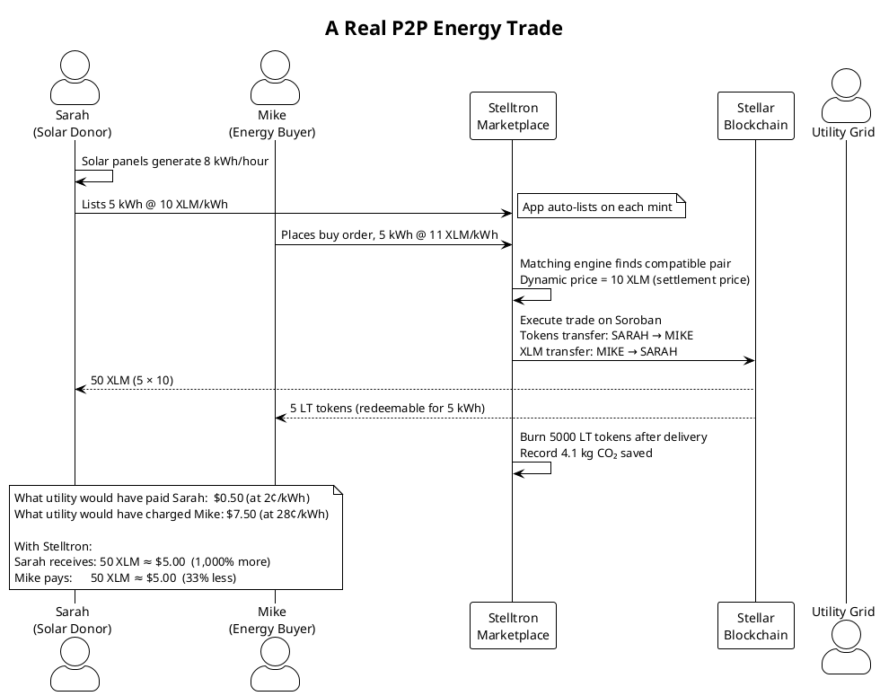
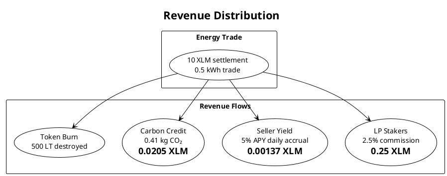
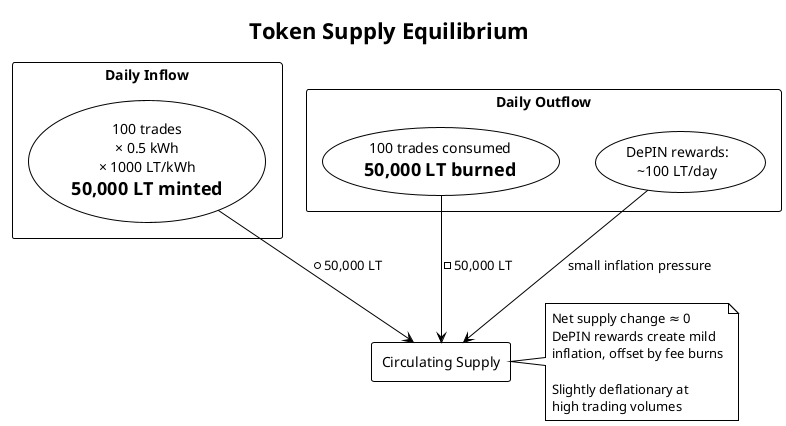

# Business Flow

A complete walkthrough of the Stelltron business model — from solar production to settled trade to revenue distribution.

---

## The Core Transaction



---

## Market Participants

| Role | What they do | How they earn |
|------|-------------|---------------|
| **Donor (Solar Owner)** | Sell excess solar energy | Revenue from energy sales + seller staking yield |
| **Recipient (Energy Buyer)** | Buy solar energy at below-grid prices | Savings vs utility rates |
| **NetworkNodeOperator (Pi Operator)** | Run Raspberry Pi relay nodes | DePIN rewards (10 LT/day + routing rewards) |
| **LP Staker** | Stake LT tokens in liquidity pool | 8.5% APY + 2.5% trade commissions |
| **Flash Borrower** | Borrow tokens for peak-demand arbitrage | Arbitrage profit minus 0.3% fee |
| **Community (Governance)** | Vote on pricing parameters | Better market conditions |

---

## Revenue Model



---

## Business Flow Diagram

```plantuml
@startuml
!theme plain

title Stelltron Business Flow — End to End

|Physical World|
start
:Solar panels generate energy;
:ESP32 monitors voltage & current;
:Raspberry Pi measures kWh transferred;

|IoT Layer|
:Pi sends POST /iot/energy/report;
:Backend calculates quality factor from voltage;
:TokensMinted = kWh × 1000 × QF;

|Blockchain Layer|
:energy_token.mint(donor_wallet, tokens);
:Tokens appear in donor's wallet;

|Marketplace|
:Auto-create sell order at dynamic price;
:Donor optionally adjusts listing price;
:Buyer places buy order;

|Matching Engine|
:Price calculated (6-factor formula);
:ZK proof: seller battery > 20%?;
if (proof valid AND prices compatible) then (yes)
  :Execute trade at dynamic price;
  :Burn tokens (kWh × 1000);
  :Record carbon credit;
  :2.5% fee → LP stakers;
  :5% APY yield → seller;
else (no)
  :Skip — wait next cycle;
endif

|Settlement|
:Soroban: energy_token.transfer();
:Update transaction status → Completed;
:SSE broadcast to frontends;

|Sustainability|
:CO₂ offset recorded;
:DePIN uptime rewards issued;
:Governance: community votes on params;

stop

@enduml
```

---

## Token Economics at Scale



---

## Payback Period Impact

The core economic value proposition:

| Metric | Without Stelltron | With Stelltron |
|--------|-------------------|----------------|
| Utility buys excess solar at | $0.02/kWh | — |
| Peer buyer pays | — | $0.10/kWh (50% below peak grid) |
| Solar owner receives | $0.02/kWh | $0.10/kWh (5× more) |
| Energy buyer pays | $0.28/kWh (peak) | ~$0.10/kWh (64% savings) |
| Solar panel ROI | 18 years | ~8 years |

---

## Roadmap

```plantuml
@startuml
!theme plain

timeline
  title Stelltron Roadmap

  section Now (MVP)
    Testnet deployment : 4 smart contracts live
    P2P marketplace : Order matching operational
    Real IoT hardware : Raspberry Pi + ESP32 integration
    Dynamic pricing : 6-factor model running
    ZK proofs : Battery privacy protection
    DeFi basics : LP staking + flash loans

  section Month 1–2
    Order types : Partial fills, limit/market/stop orders
    Mobile app : iOS and Android
    Better UX : Smoother onboarding

  section Month 3–6
    Hardware pilot : 10 real households in one neighborhood
    Mainnet : Move from testnet to Stellar mainnet
    Real kWh trading : Regulatory sandbox application

  section Month 6–12
    DeFi expansion : Liquidity pools, yield farming, savings accounts
    Scale : 1,000 households across 3 cities
    Stablecoin : USDC integration for fiat-equivalent pricing

  section Year 2–3
    International : India, Kenya, Philippines expansion
    Partnerships : Solar installers, battery manufacturers
    Regulatory : Full energy trading licenses

  section 2030 Goal
    Impact : 100 million households
    CO2 : 500 million tons CO2 offset

@enduml
```
