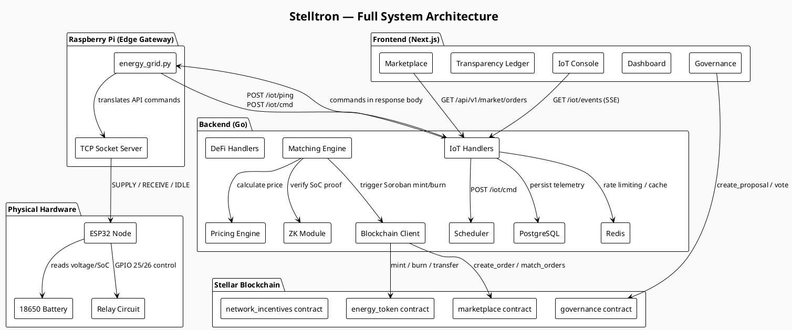
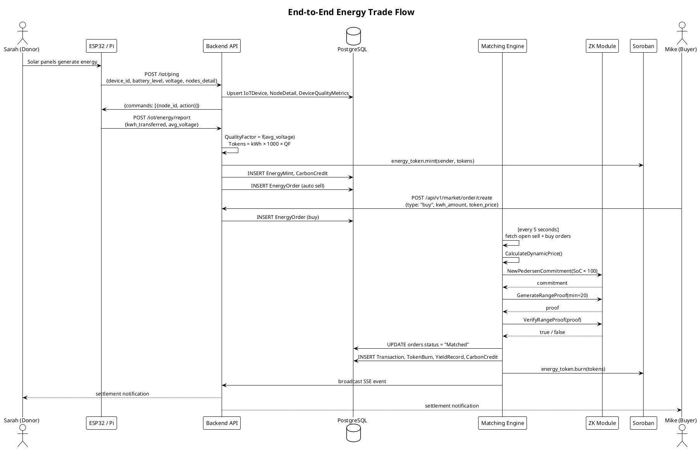
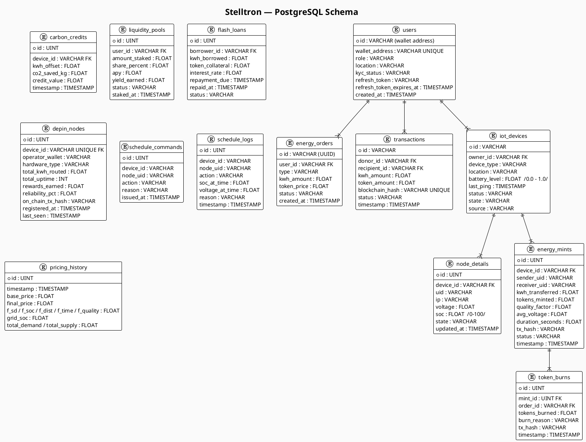
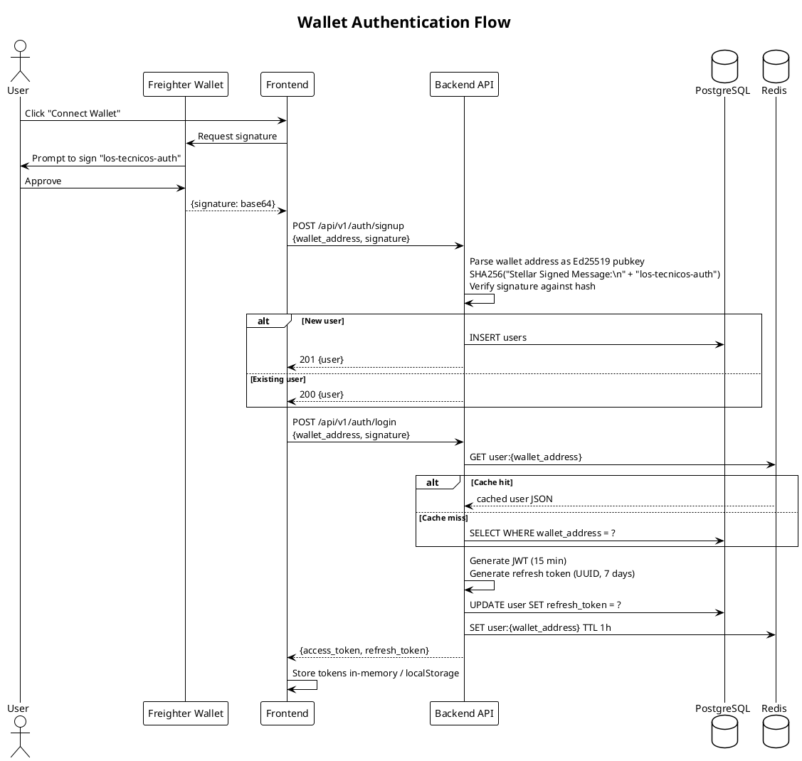

# System Architecture

Stelltron is a full-stack application spanning physical hardware, an IoT communication layer, a Go backend, a Next.js frontend, and four Soroban smart contracts on Stellar. Every layer has a defined contract with the layers above and below it.

---

## High-Level Stack

| Layer | Technology | Role |
|-------|-----------|------|
| Hardware | ESP32, 18650 Li-ion, relays | Measure and route physical energy |
| IoT Protocol | HTTP (REST), Server-Sent Events | Transport telemetry to backend |
| Backend | Go, Gin, GORM, PostgreSQL, Redis | Business logic, matching, pricing |
| Blockchain | Stellar Soroban (Rust/WASM) | Token settlement, governance |
| Frontend | Next.js, React, TailwindCSS | User interface |
| Hosting | Render (backend), Vercel (frontend) | Cloud deployment |

---

## Full System Diagram



---

## Data Flow: End-to-End Energy Trade



---

## Database Schema



---

## Component Responsibilities

### Backend Package Structure

```
backend/
├── cmd/api/main.go              Entry point, wires all components
├── internal/
│   ├── config/                  Env var helpers
│   ├── cache/                   Redis client singleton
│   ├── database/                GORM PostgreSQL setup + AutoMigrate
│   ├── core/domain/models.go    All domain structs (17 models)
│   ├── handlers/                HTTP handlers (routes.go registers all 44 routes)
│   │   ├── handlers.go          Auth, market, devices, analytics
│   │   ├── iot_ping.go          IoT heartbeat + node data + SSE broker
│   │   ├── iot_cmd.go           Scheduling endpoint
│   │   ├── iot_transfer.go      Manual transfer commands
│   │   ├── energy_mint.go       Token minting from energy reports
│   │   ├── defi.go              LP staking, flash loans
│   │   ├── ledger.go            Transparency endpoints
│   │   ├── depin.go             DePIN node registry
│   │   ├── middleware.go        JWT auth middleware
│   │   └── requests.go          Request struct definitions
│   ├── matching/engine.go       Order matching loop (every 5s)
│   ├── pricing/dynamic_engine.go  Six-factor pricing model
│   ├── scheduling/scheduler.go  Grid SoC-based command scheduling
│   ├── zk/commitment.go         Pedersen commitments + range proofs
│   ├── blockchain/soroban.go    Soroban client wrapper
│   └── mqtt/client.go           MQTT command dispatch
```

### Authentication Flow


