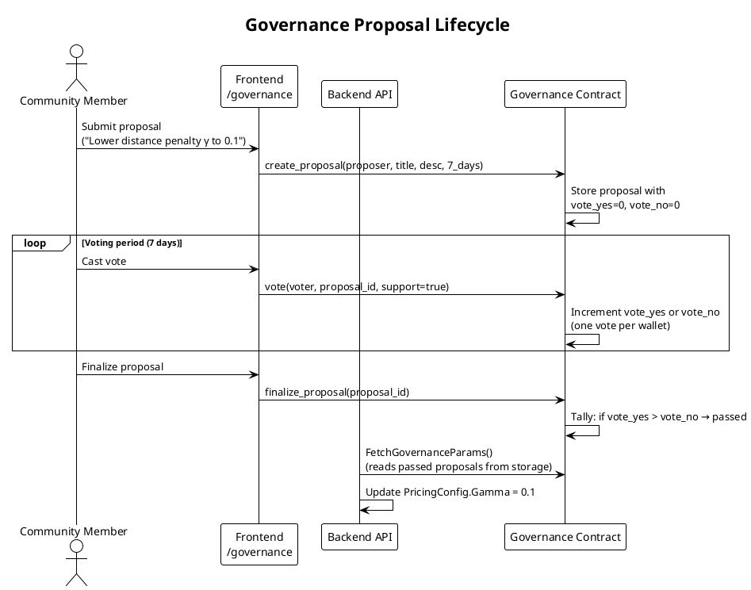
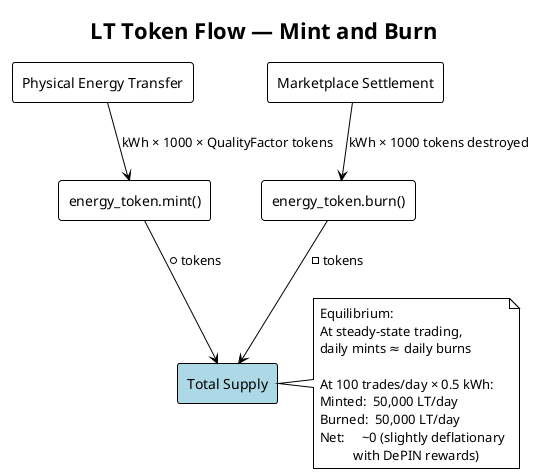

# Smart Contracts

Stelltron deploys four Soroban contracts on the Stellar testnet, written in Rust and compiled to WASM. All contracts are under 200 lines each, intentionally lean — on-chain storage is expensive, so the Soroban contracts handle token accounting and governance, while the Go backend handles order books and matching logic.

---

## Deployed Contracts

| Contract | Purpose |
|----------|---------|
| `energy_token` | Token minting, burning, transfer — the LT token ledger |
| `marketplace` | Order creation, matching execution on-chain |
| `governance` | Community proposals and voting |
| `network_incentives` | DePIN node registration and reward tracking |

Contract IDs are set via environment variables (`TOKEN_CONTRACT_ID`, etc.) and injected at startup.

---

## energy_token

The core token contract. Implements a custom fungible token for LT (Los Técnicos Energy Token).

**Storage keys:**
```rust
pub enum DataKey {
    Admin,
    Balance(Address),
    TotalSupply,
    TotalBurned,
}
```

Instance storage holds `Admin`, `TotalSupply`, `TotalBurned`. Persistent storage holds per-address `Balance` entries.

**Functions:**

```rust
// One-time setup — sets admin address, initializes supply to 0
pub fn initialize(env: Env, admin: Address)

// Mint tokens when Pi reports energy transfer — admin-only
pub fn mint(env: Env, to: Address, amount: i128)

// Burn tokens on trade settlement — admin-only
// Permanently removes from TotalSupply, increments TotalBurned
pub fn burn(env: Env, from: Address, amount: i128)

// Transfer between wallets — called during marketplace settlement
// Requires from.require_auth() — user must sign
pub fn transfer(env: Env, from: Address, to: Address, amount: i128)

// Read-only queries
pub fn get_balance(env: Env, user: Address) -> i128
pub fn total_supply(env: Env) -> i128
pub fn total_burned(env: Env) -> i128
```

**Authorization model:**
- `mint` and `burn`: Admin-only (oracle backend orchestrates these)
- `transfer`: Requires the sender's authorization (`from.require_auth()`)
- No allowance/approval mechanism in V1 — direct user signatures required

**Unit tests cover:**
- Mint → balance increase + total supply increase
- Burn → balance decrease + total supply decrease + total burned increase
- Transfer → balance redistribution without supply change

---

## marketplace

Handles on-chain order representation and trade execution. In Stelltron's architecture, the Go matching engine runs the order book off-chain (PostgreSQL) and calls the Soroban contract only to execute finalized trades.

```rust
pub fn create_order(env: Env, user: Address, order_type: String, kwh: i128, price: i128, device_id: String)

pub fn match_orders(env: Env, sell_id: u64, buy_id: u64)
// Admin validates matching conditions and executes settlement

pub fn calculate_yield(env: Env, amount: i128) -> i128
// Historical experimental yield helper; not exposed as a production product claim

pub fn get_order(env: Env, order_id: u64) -> Order
```

---

## governance

Allows community members to propose and vote on parameter changes (pricing coefficients, grid rules, DeFi parameters).

```rust
pub fn create_proposal(env: Env, proposer: Address, title: String, description: String, duration_seconds: u64)

pub fn vote(env: Env, voter: Address, proposal_id: u64, support: bool)
// One wallet = one vote

pub fn finalize_proposal(env: Env, proposal_id: u64)
// Tallies votes after deadline. Result written to contract storage.
// Backend reads this to update PricingConfig coefficients.

pub fn get_proposal(env: Env, proposal_id: u64) -> Proposal
```

**Governance flow:**



---

## network_incentives

Tracks DePIN node participation and reward distribution.

```rust
pub fn register_node(env: Env, node_id: String, operator: Address)
// Registers hardware; emits 100 LT one-time reward

pub fn report_activity(env: Env, node_id: String, packets: u64)
// Records packet routing activity
// Reward: 1 LT per 100 packets (i.e. 0.01 LT/packet)

pub fn get_node_info(env: Env, node_id: String) -> NodeInfo
```

---

## Token Economics



**Minting formula:**
```
TokensMinted = kWh_transferred × 1000 × QualityFactor

QualityFactor:
  avgVoltage in [3.6, 4.2]V → 1.0 + (avgVoltage - 3.6) / 6.0
  (range: 1.0 to 1.1)
  avgVoltage outside range    → 0.85 (penalty)

Example: 0.5 kWh at 4.0V
  = 0.5 × 1000 × (1.0 + (4.0 - 3.6)/6.0)
  = 500 × 1.0667
  = 533.3 LT
```

---

## Deployment

The `deploy.sh` script automates:
1. Compile all contracts to WASM with `cargo build --target wasm32-unknown-unknown --release`
2. Deploy each WASM to Stellar testnet with `stellar contract deploy`
3. Initialize each contract (set admin to oracle key)
4. Write contract IDs to backend `.env` file

```bash
cd stellar_smart_contract
./deploy.sh
```

After deployment, the backend reads contract IDs via environment variables:
- `TOKEN_CONTRACT_ID`
- `MARKETPLACE_CONTRACT_ID`
- `GOVERNANCE_CONTRACT_ID`
- `NETWORK_INCENTIVES_CONTRACT_ID`
