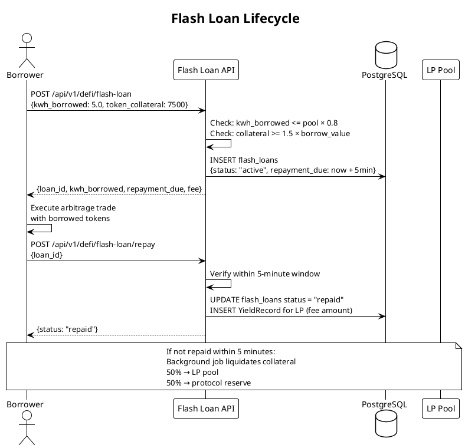
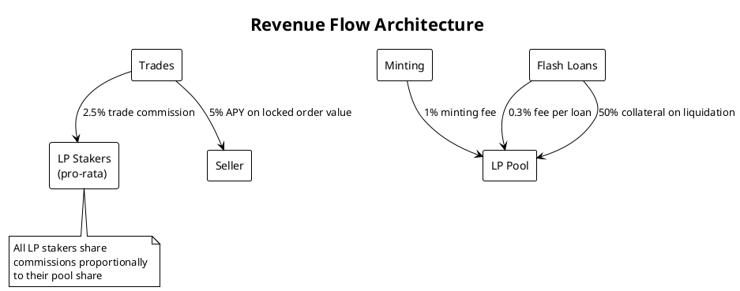

# DeFi Protocol

Stelltron builds a DeFi layer on top of physical energy trading. Participants earn yield by providing liquidity, borrowing tokens for arbitrage, and capturing trade commissions.

---

## Liquidity Pool (LP) Staking

Anyone can stake LT tokens into the shared liquidity pool. Stakers earn from three revenue streams:

| Source | Rate |
|--------|------|
| Base APY | 8.5% annually (dynamic) |
| Trade commission | 2.5% of every matched trade |
| Flash loan fee | 0.3% per flash loan |

### Dynamic APY Formula

```
If TVL <= 10,000 LT:   APY = 8.5%   (base rate)
If TVL > 10,000 LT:    APY = 8.5% × (10,000 / TVL)
                        floor: 3.0% minimum
```

**Rationale:** Early stakers earn higher yields to bootstrap liquidity. As TVL grows, APY compresses toward a sustainable floor.

### Yield Calculation

```
Yield = AmountStaked × (APY / 100) × (HoursStaked / 8760)

Example: 1000 LT staked for 48 hours at 8.5% APY
  = 1000 × 0.085 × (48/8760)
  = 0.466 LT yield
```

Yield accrues continuously. Unstaking calls `HandleLPUnstake()` which calculates yield from `staked_at` to `time.Now()`.

---

## Flash Energy Lending

Flash loans allow borrowers to obtain tokens instantly for within-epoch arbitrage or peak-demand coverage.

| Parameter | Value | Rationale |
|-----------|-------|-----------|
| Fee | 0.3% of borrowed amount | Low enough for arbitrage, revenue for LP |
| Maximum borrow | 80% of pool TVL | Prevents pool drain |
| Collateral required | 150% of borrow value | Covers default + protocol profit |
| Repayment window | 5 minutes (300 seconds) | One "energy epoch" |
| If not repaid | Auto-liquidation | 50% of collateral → LP pool |

**Use case:** Borrower needs immediate tokens to cover a peak-demand trade. Borrows from pool, executes trade at high price, repays loan + 0.3% fee. Profit = price spread minus fee.



---

## Seller Staking Yield

Sellers earn a 5% APY simulation on the value of their locked sell orders while they remain open:

```go
// In matching engine, on trade settlement:
yieldAmount := buyOrder.KwhAmount * dynamicPrice * 0.05 / 365

yieldRecord := domain.YieldRecord{
    UserID:    sellOrder.UserID,
    Amount:    yieldAmount,
    Source:    "LiquidityPool_Staking",
    Timestamp: time.Now(),
}
```

This incentivizes sellers to list energy (instead of holding tokens) by rewarding them for the period their energy was available to the market.

---

## Revenue Streams Summary



| Revenue Stream | Rate | Destination |
|----------------|------|-------------|
| Trade commission | 2.5% of settlement | LP stakers (pro-rata) |
| Minting fee | 1% of tokens | LP pool |
| Flash loan fee | 0.3% per loan | LP pool |
| Flash liquidation | 50% of collateral | LP pool |
| Seller staking yield | 5% APY on order | Seller |

---

## Break-Even Analysis

```
Daily commission at 35 trades × 0.5 kWh × 5.5 XLM/kWh × 2.5%:
= 35 × 0.5 × 5.5 × 0.025
= 2.41 XLM/day in commission

Annual run rate: ~880 XLM in commission alone (~$88 at $0.10/XLM)
```

At higher trade volumes and energy prices, protocol revenue scales proportionally.

---

## Carbon Credit Economics

Each P2P trade avoids grid electricity consumption, generating verifiable carbon savings:

```
CO₂_saved = kWh_transferred × 0.82  (India grid emission factor: 0.82 kg CO₂/kWh)
CreditValue = CO₂_saved × 0.05      (0.05 XLM per kg CO₂)

Example: 0.5 kWh trade
  → 0.41 kg CO₂ saved
  → 0.0205 XLM credit value

Tree equivalent: 1 tree absorbs ~21.77 kg CO₂/year
  → A single household trading 10 kWh/day saves
     ~3 kg CO₂/day = ~1,095 kg CO₂/year
     = ~50 tree-equivalents/year
```

Carbon credits are recorded per trade in `carbon_credits` and queryable via `GET /api/v1/ledger/carbon`.
