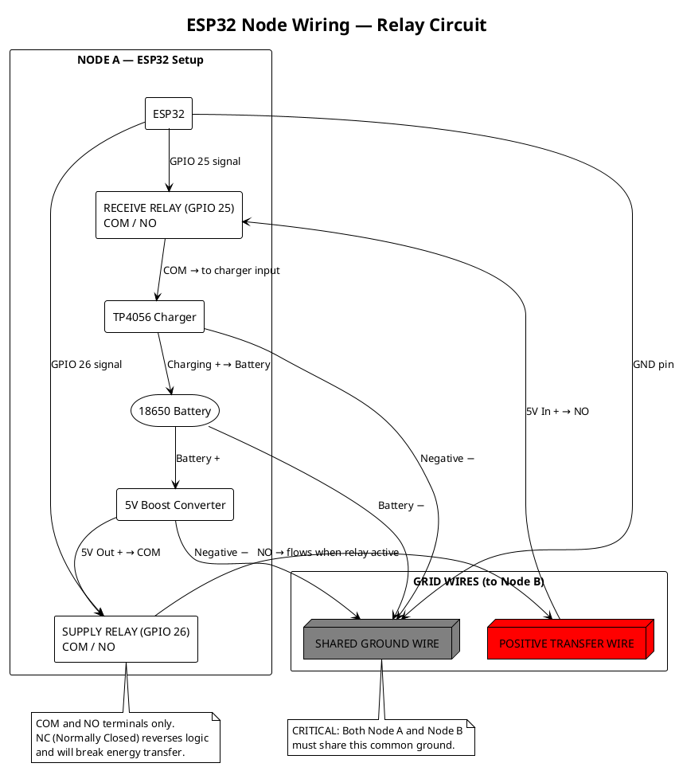
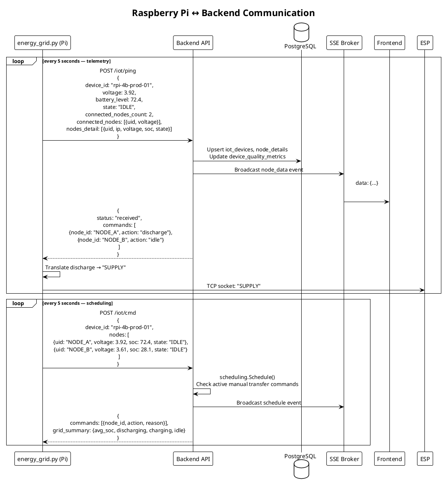
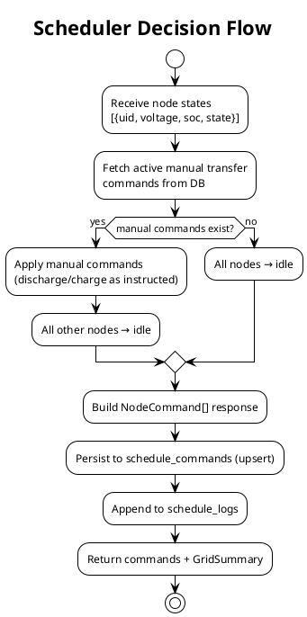

# IoT Layer

The physical layer consists of ESP32 microcontrollers managing actual battery-to-battery energy transfer, orchestrated by a Raspberry Pi 4B acting as a local edge gateway. The Pi handles bidirectional communication between the hardware relay circuit and the cloud backend.


The image shows the current Wh-scale 5V/18650 prototype. The 50-home Delhi NCR view is a separate digital-twin projection.

---

## Hardware Stack

| Component | Role |
|-----------|------|
| Raspberry Pi 4B | Edge gateway — runs Python control script, talks to backend |
| ESP32 microcontroller | Relay control, voltage/SoC sensing, TCP socket server |
| 18650 Li-ion batteries | Energy storage nodes |
| 5V Boost Converter | Steps up battery voltage for transmission |
| TP4056 Charger Module | Charges receiving battery |
| Relay × 2 per node | GPIO-controlled SUPPLY and RECEIVE paths |

The chipset MAC address is the canonical kit identity. Labels such as `NODE_A` remain friendly aliases only.

---

## Physical Wiring



**Critical wiring rules:**
- Relays must use `COM` and `NO` (Normally Open) terminals — `NC` reverses logic
- Both nodes must share a **common ground wire**
- Absence of common ground will prevent any current flow regardless of relay state

---

## Command Translation Protocol

The backend and Raspberry Pi speak in abstract commands (`discharge`, `charge`). The ESP32 understands a custom TCP Socket protocol with physical commands.

The Python script on the Pi (`energy_grid_updated.py`) performs the translation:

| Backend / Scheduler Action | Transmitted to ESP32 via TCP | Physical Effect |
|---------------------------|------------------------------|-----------------|
| `discharge` | `SUPPLY` | Opens GPIO 26 → relay activates boost converter → energy flows out |
| `charge` | `RECEIVE` | Opens GPIO 25 → relay activates TP4056 charger → energy flows in |
| `idle` (or none) | `IDLE` | All relays close — safe default state |

---

## Raspberry Pi Communication Flow



---

## IoT Ping Payload Schema

The Raspberry Pi sends two distinct payload types to `POST /iot/ping`:

**Heartbeat** (sent when Pi boots or reconnects):
```json
{
  "device_id": "rpi-4b-prod-01",
  "mac_address": "DC:A6:32:00:10:01",
  "hardware_profile": "prototype_5v_18650",
  "status": "heartbeat"
}
```

**Node data** (sent every cycle with full telemetry):
```json
{
  "device_id": "rpi-4b-prod-01",
  "voltage": 3.921,
  "battery_level": 72.4,
  "state": "IDLE",
  "source": "rpi_energy_grid",
  "timestamp": "2026-02-23T09:56:48Z",
  "connected_nodes_count": 2,
  "connected_nodes": [
    {"uid": "NODE_A", "voltage": 3.921},
    {"uid": "NODE_B", "voltage": 3.610}
  ],
  "nodes_detail": [
    {"uid": "NODE_A", "mac_address": "78:21:84:BD:C9:64", "ip": "10.42.0.204", "voltage": 3.921, "soc": 72.4, "state": "IDLE", "source": "rpi_energy_grid"},
    {"uid": "NODE_B", "mac_address": "02:B4:21:10:42:76", "ip": "10.42.0.76", "voltage": 3.610, "soc": 28.1, "state": "IDLE", "source": "rpi_energy_grid"}
  ]
}
```

---

## Voltage Stability Scoring

After each telemetry report, the backend computes a voltage stability score for the device's quality metrics:

```
avgVoltage = (primary_voltage + sum(node_voltages)) / count
deviation = |avgVoltage - 3.85|          # 3.85V is midpoint of 3.7–4.2V Li-ion range
score = 100 - (deviation / 0.35 × 100)
clamp(score, 0, 100)
```

This score feeds the seller quality factor (F_quality) in the pricing engine.

---

## SSE Event Types

The backend broadcasts real-time events to any connected frontend client via `GET /iot/events`:

| Event Type | When Fired | Payload |
|------------|-----------|---------|
| `heartbeat` | Pi sends heartbeat | `{device_id, status}` |
| `node_data` | Pi sends full telemetry | Full ping payload |
| `schedule` | Scheduler runs | `{device_id, commands, grid_summary}` |
| `energy_mint` | Pi reports energy transfer | `{kwh_transferred, tokens_minted, co2_saved_kg, ...}` |

---

## Energy Reporting: Physical to Token

When a physical energy transfer completes, the Pi reports it:

```
POST /iot/energy/report
{
  "device_id":        "rpi-4b-prod-01",
  "sender_uid":       "NODE_A",
  "receiver_uid":     "NODE_B",
  "kwh_transferred":  0.5,
  "duration_seconds": 1800,
  "avg_voltage":      3.92,
  "avg_current":      0.27
}
```

**Backend processing:**
1. Validate kWh in `[0.001, 10.0]` range
2. Check active `discharge` command exists for `sender_uid`
3. Calculate quality factor from `avg_voltage`
4. Compute: `TokensMinted = kWh × 1000 × QualityFactor`
5. Call `energy_token.mint(sender, tokens)` on Soroban
6. Record `EnergyMint`, auto-create sell order at current dynamic price
7. Record `CarbonCredit` (`kWh × 0.82 kg/kWh`)
8. Broadcast `energy_mint` SSE event

---

## Grid Scheduler

The scheduler (`scheduling.Schedule()`) determines which nodes should discharge or charge, based on manual transfer commands from the frontend:



The auto-balance algorithm (`ScheduleAuto`) implements SoC-based pair matching but is **not** called in production — all transfers are initiated through the frontend's manual transfer interface.

**SoC thresholds for auto-balance (reference):**

| Threshold | Value | Meaning |
|-----------|-------|---------|
| `SoCCritical` | 20% | Node must receive charge |
| `SoCLow` | 40% | Node should receive charge |
| `SoCHigh` | 70% | Node can donate |
| `SoCFull` | 90% | Node should donate |
| `BalanceDeadband` | 10% | Spread below this → no action needed |
| `MinTransferGap` | 15% | Minimum SoC gap between sender and receiver |

---

## DePIN Node Registry

Raspberry Pi hardware nodes can register in the DePIN (Decentralized Physical Infrastructure) registry:

```
POST /api/v1/depin/register
POST /api/v1/depin/heartbeat
GET  /api/v1/depin/nodes
GET  /api/v1/depin/stats
```

**Reward structure:**

| Action | Reward |
|--------|--------|
| Initial registration | 100 LT |
| 24h uptime maintained | 10 LT/day |
| Routing 1 kWh | 1 LT |
| >90% monthly uptime | 50 LT bonus |

**Reliability score:**
```
ReliabilityPct = (TotalUptime / TimeSinceRegistration) × 100
```
