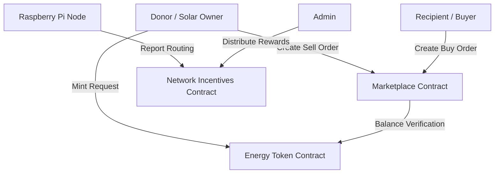

# Decentralized Energy Grid - Soroban Smart Contracts

This repository contains a minimalistic working version of the Stellar Soroban smart contracts for a decentralized P2P energy trading marketplace.

## Project Overview

The system enables rooftop solar owners (donors) to tokenize excess energy and sell it to community members (recipients). Raspberry Pi nodes facilitate the data routing and earn rewards for maintaining the network mesh.

## Core Smart Contracts

1.  **Energy Token (`energy-token`)**: 
    - Handles the `CommunityEnergy` token.
    - Donors mint tokens after production is verified.
    - Recipients burn tokens upon consumption.
2.  **Marketplace (`marketplace`)**:
    - Manage buy and sell orders for energy.
    - Pairs participants based on kwh amount and price.
    - Handles status transitions (Open, Matched, Completed).
3.  **Network Incentives (`network-incentives`)**:
    - Registers Raspberry Pi nodes.
    - Tracks packet routing activity.
    - Distributes rewards based on network contribution.

## Program Flow

1.  **Initialization**: The Admin initializes all three contracts with their respective authorities.
2.  **Tokenization**: 
    - A donor produces energy, verified by an ESP32.
    - The Admin (or an authorized device) mints `CommunityEnergy` tokens to the donor's wallet in the `energy-token` contract.
3.  **Market Listing**: 
    - The donor creates a **Sell Order** in the `marketplace` contract, specifying the energy amount and desired price (XLM).
    - A recipient creates a **Buy Order** or matches an existing sell order.
4.  **Order Matching**: 
    - When orders match, the `marketplace` updates status to `Matched`.
    - Funds/Tokens enter an escrow state (logically tracked via status).
5.  **Completion**: 
    - Once physical transfer is verified by IoT devices, the trade is finalized.
    - XLM is transferred to the seller (XLM handled via Stellar Asset Contract - SAC).
    - Energy tokens are transferred to the recipient.
6.  **Network Rewards**: 
    - Raspberry Pi nodes report their routing activity to the `network-incentives` contract.
    - Nodes accrue rewards (XLM stroops) based on the volume of data handled.

## How to Run

### Prerequisites

- [Rust & Cargo](https://rustup.rs/)
- [Soroban CLI](https://soroban.stellar.org/docs/getting-started/setup)

### Build the Contracts

From the root of the project (`stellar_smart_contract`), run:

```bash
cargo build --target wasm32-unknown-unknown --release
```

The compiled `.wasm` files will be located in:
`target/wasm32-unknown-unknown/release/*.wasm`

### Run Tests

Each contract includes unit tests (minimal version). Run all tests with:

```bash
cargo test
```

## Architecture



---
*Note: This is a minimalistic implementation designed for clarity and extensibility. For production, additional security layers like cross-contract authentication and more robust escrow logic should be added.*
